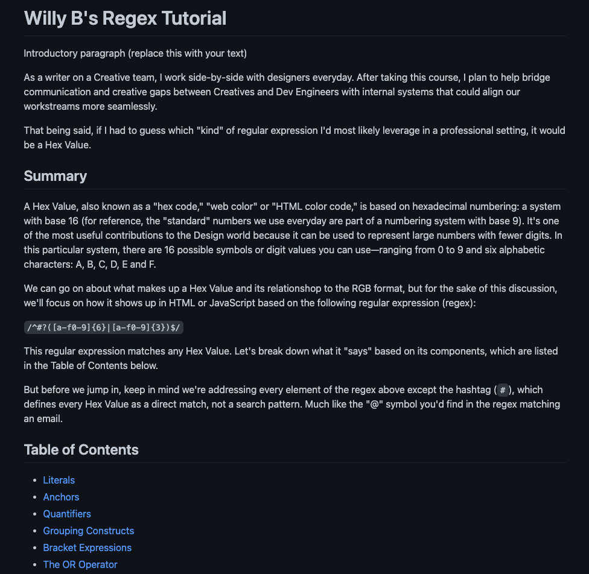

# Willy B's Regex Tutorial

This is my first deep-dive into the world of regular expressions. After breaking down the components of a regex matching a Hex Value, I created a tutorial using GitHub gist and generated a .md file containing a Table of Contents featuring an explanation and use case for each component used in the following:

`/^#?([a-f0-9]{6}|[a-f0-9]{3})$/`

As specified in the Challenge Acceptance Criteria, the tutorial achieves the following:

✨ A descriptive title and introductory paragraph explains the purpose of the tutorial, a summary describes the regex featured in the tutorial, a table of contents links to different sections that break down each component of the regex and explain what it does, and a section about the author includes a link to the author’s GitHub and LinkedIn profiles.

✨ Links in the Table of Contents take you to the corresponding sections of the tutorial.

✨ Each section contains a detailed explanation of what a specific component of the regex does.

✨ A section about the author includes a link to the author’s GitHub and LinkedIn profiles.

Below is a screenshot of my latest and greatest:

To visit Willy B's Regex Tutorial, click [here](https://gist.github.com/willbrennana/4b7d12a5975b6b4844ace79b4b312bd9).
